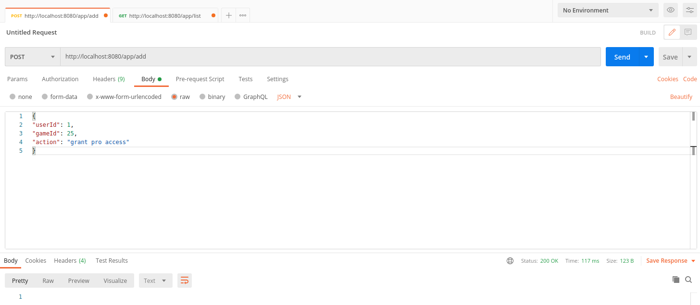
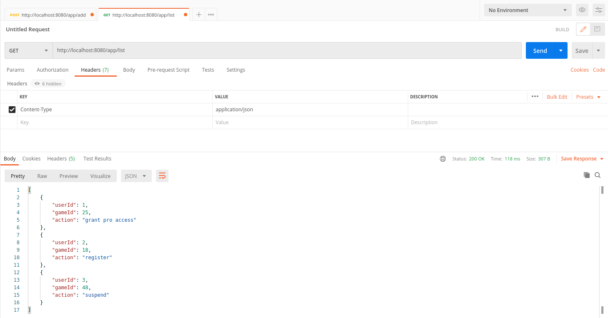
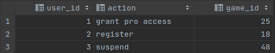

# Games

## Technogy Stack
* Java
* Spring MVC
* MySQL
* Postman (testing purpose)


## Application Testing
### 1. Clone repository to your local machine
### 2. Open POSTMAN

### 3.Adding object: method „POST” 
Path: http://localhost:8080/app/add<br>
Successfull request get response: 'status 200'.
Headers: Key=”Content-Type”<br> Value=”application/json”
Body (JSON):

a) either with specified userId
````json
[{
"userId": 1,
"gameId": 25,
"action": "grant pro access"
}]
````
b) or userId set for null, then the lowest unique number will be picked up for jpa
````json
[{
"userId": null,
"gameId": 18,
"action": "register"
}]
````


### 4. Displaying list: method „GET” 
Path: http://localhost:8080/app/list<br>
Returns list of objects from database.<br>
Successfull request get response: 'status 200'.

JSON:
````json
[{
"userId": 1,
"gameId": 25,
"action": "grant pro access"
},

{
"userId": null,
"gameId": 18,
"action": "register"
},

{
"userId": 5,
"gameId": 48,
"action": "suspend"
}]
````


### 5. MySql view

